build-lists: true
slidenumbers: true

# Hello!

^ Hi.

---

# # TODO: add comments

## 5 Tips for _Winning_ at Code Comments

### (according to Nik Kantar)

---

## Nik Kantar

- I make software things, often with Python.
- web(log): [nkantar.com](https://nkantar.com)
- code: [@nkantar](https://github.com/nkantar) (GitHub)
- toots: [@nkantar](https://twitter.com/nkantar) (Twitter)
- email: [nik@nkantar.com](mailto:nik@nkantar.com) (plz no recruiters)
- slides: [nkantar.com/talks](https://nkantar.com/talks)

---

## This talk…

- …is opinionated,
- and aims to be helpful
- and _hilarious_,
- but could probably use some work.
  (Read: feedback welcome!)

---

## The basics

- Q: What are code comments?
- A: `# this stuff`
- Q: Why are they important?
- A: Code is written for humans.
- Q: Who are they for?
- A: Me, you (6 months later), everyone else.

---

## Advice-disguised-as-a-joke

Write your code as if the person inheriting it is an axe murderer who knows where you live.

---

## The 5 tips

1. Make comments stand out in your editor.
- Explain the _why_, not the _what_.
- Don't fear the paragraph.
- Read what you wrote out loud.
- Ask for help!

---

## 1. Make comments stand out.

---

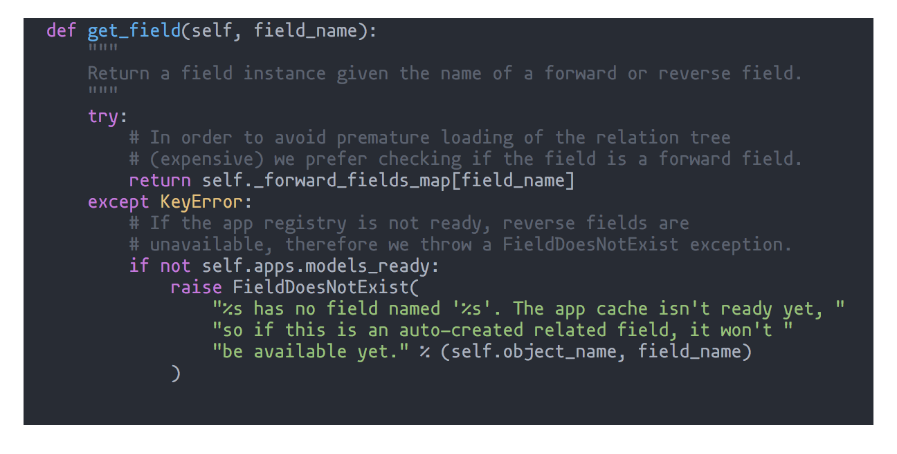

---

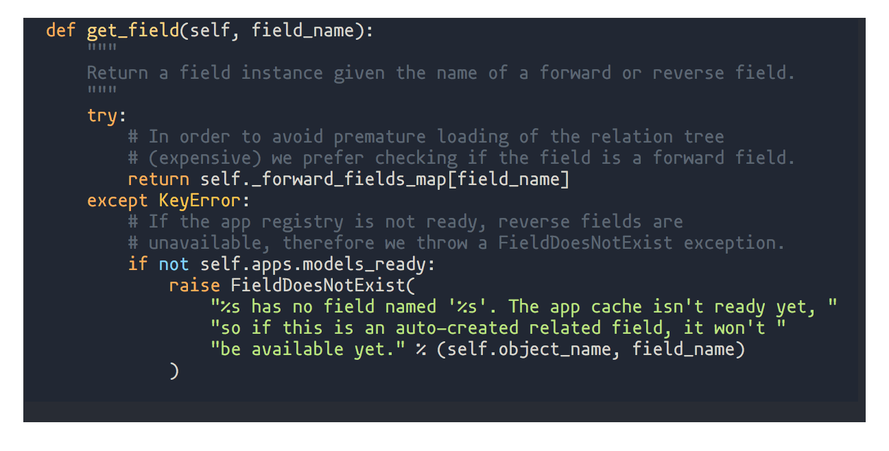

---

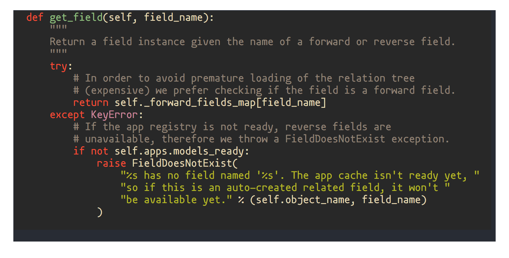

---

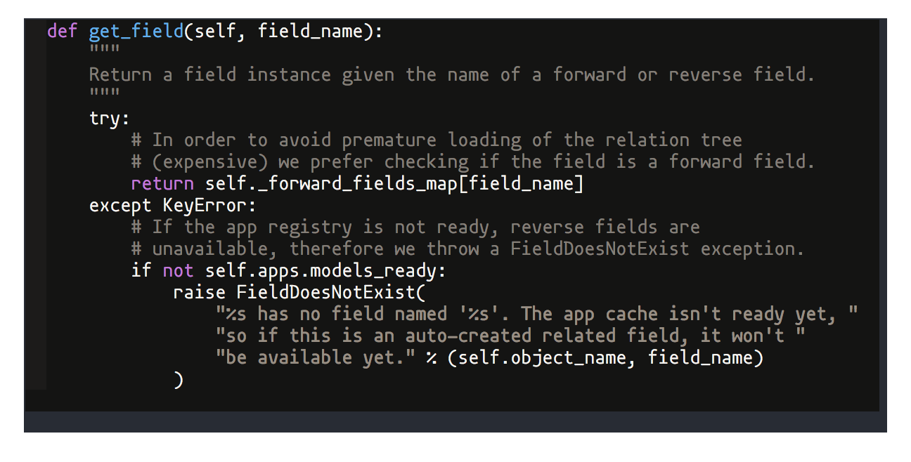

---

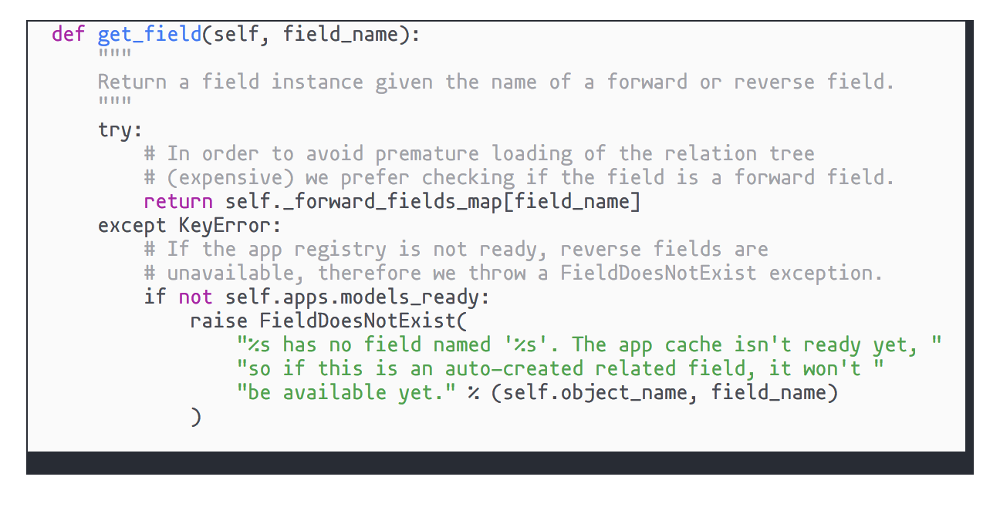

---

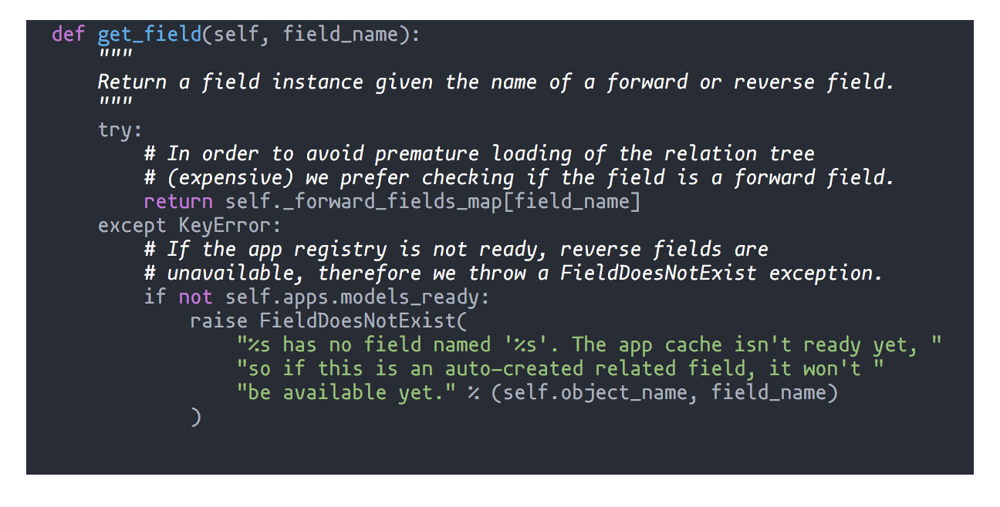

---

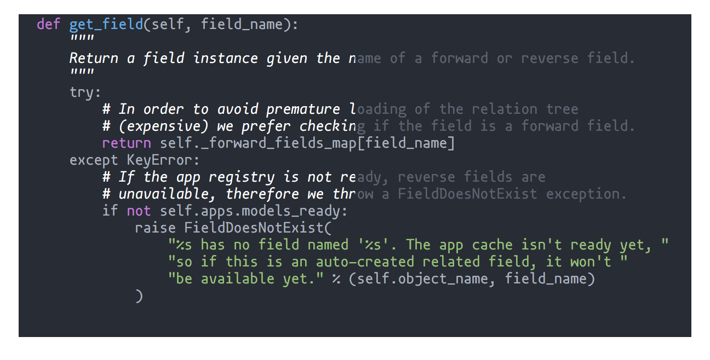

---

### Bad documentation is worse than no documentation.

---

## Conclusion #1:
## Make comments stand out.

---

## 2. _Why_, not _what_.

---

## _What_ vs _why_

- Myth: "Code is self-documenting."
- Truth: "Code can self-document _what_ happens."
- Comments: _Why_ is this…
  - …here?
  - …done this way?

---

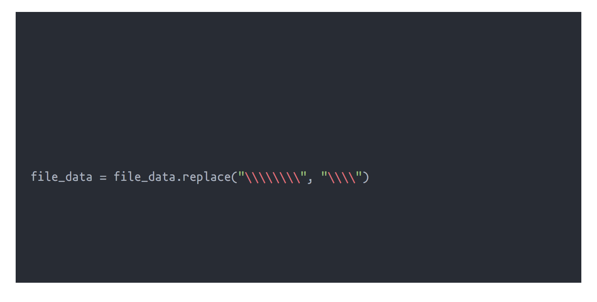

---

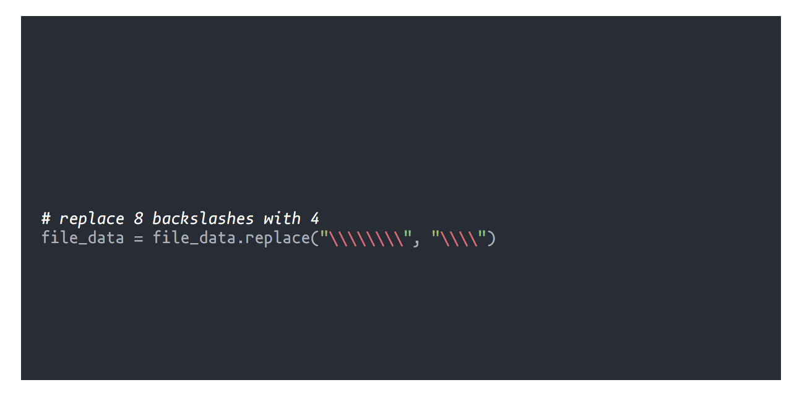

---

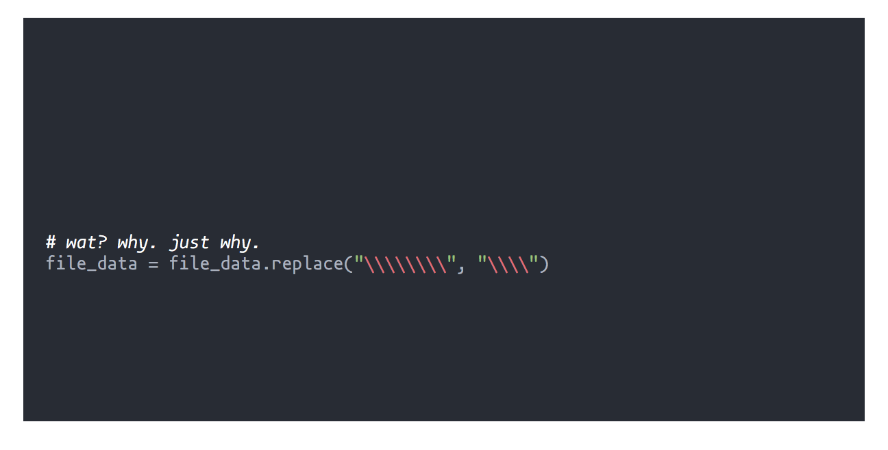

---

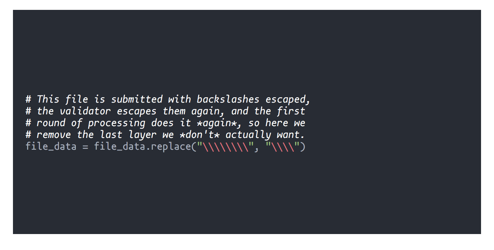

---

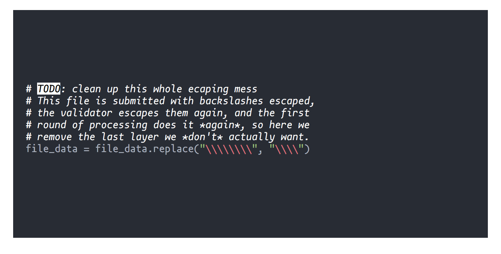

---

## Conclusion #2:
## Explain the _why_, not the _what_.

---

## 3. Don't fear the paragraph.

---

## Brevity is a virtue, until it isn't.

- No bonus points for brevity at the expense of thoroughness.
- It's OK to have more comments than code.

---

## Advice-disguised-as-a-joke, repeated

Write your code as if the person inheriting it is an axe murderer who knows where you live.

---

## Conclusion #3:
## Don't be unnecessarily brief.

---

## 4. Read what you wrote out loud.

---

## Language matters

- Hearing your words will help you evaluate them.
- It helps with…
  - …typos!
  - …bad grammar!
  - …just plain nonsense (especially applicable if you've been staring at the screen for too long)!

---

## Conclusion #4:
## Read your comments out loud.

---

## 5. Ask for help!

---

## Multiple perspectives

- Comments are largely for others—why not ask for feedback?
- Experts can verify correctness and completeness.
- Newbies can very clarity.
- Everyone can pinpoint obvious issues.
- Great writers have great editors.

---

## Conclusion #5:
## Ask for help!

---

# Thank you!

## Please send me feedback.

---

# Questions?

-

### Slides: nkantar.com/talks
