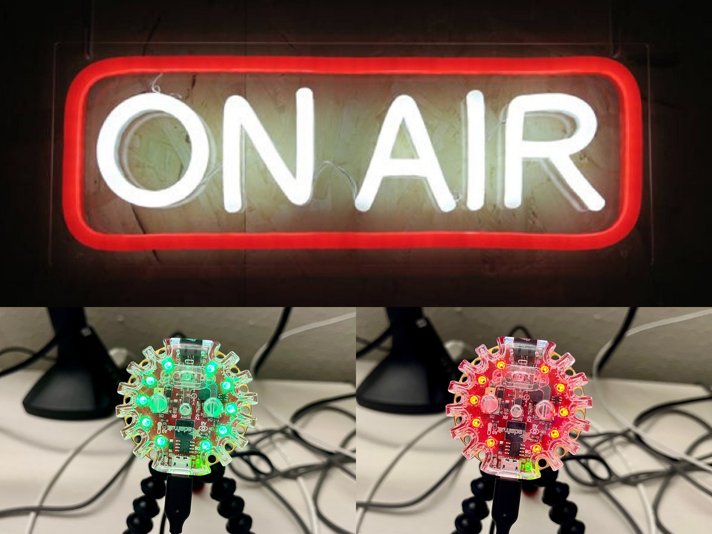

build-lists: true
slidenumbers: true
slidecount: true
footer: nkantar.com


# Adafruit Circuit Playground Express as an “On Air” Light

## Nik Kantar

### PyOhio 2023


--------------------------------------------------


# Nik Kantar

- Professional & unprofessional Pythonista
- Web(log): [nkantar.com](https://nkantar.com)
- Code: [@nkantar](https://github.com/nkantar) (GitHub)
- Toots: [nkantar.social/@nik](nkantar.social/@nik) (Fediverse/Mastodon)
- Email: [nik@nkantar.com](mailto:nik@nkantar.com)
- Possibly available for hire!


--------------------------------------------------


# Project Overview



^
- customizable, affordable on-air light


--------------------------------------------------


# Background

```
┌─────────────────────────────────────────────────────┐
│ ┌────────────────────┐                              │
│ │                    │                              │
│ │        DESK        │                      KITCHEN │
│ │                    │                              │
│ └────────────────────┘                              │
│                                           ┌─────────┘
│                                           │          
│                                           └─────────┐
│                                                     │
│                                            ENTRYWAY │
│                                                     │
│         LIVING                                      │
│          ROOM                                       │
│                                                     │
│                                                     │
└──────────────────────────────────────┐         ┌────┘
                                       │         │     
                                       │ HALLWAY │     
                                       │         │     
                                       │         │     
```

^
- used to work in living room


--------------------------------------------------


# Background

```
┌─────────────────────────────────────────────────────┐
│ ┌────────────────────┐                              │
│ │                    │                              │
│ │        DESK        │             ┌─ ── ── KITCHEN │
│ │                    │             │                │
│ └────────────────────┘                              │
│                                    │      ┌─────────┘
│                                    │      │          
│                                           └─────────┐
│                                    │                │
│                                    │       ENTRYWAY │
│                                                     │
│         LIVING                     │                │
│          ROOM                      └─ ── ─┐         │
│                                                     │
│                                           │         │
└──────────────────────────────────────┐    │    ┌────┘
                                       │         │     
                                       │ HALLWAY │     
                                       │         │     
                                       │         │     
```

^
- wife needs kitchen access


--------------------------------------------------


# Background

```
┌─────────────────────────────────────────────────────┐
│ ┌────────────────────┐                              │
│ │                    │                              │
│ │        DESK        │ ── ── ── ── ┬─ ── ── KITCHEN │
│ │                    │             │                │
│ └────────────────────┘                              │
│                                    │      ┌─────────┘
│                                    │      │          
│                                           └─────────┐
│                                    │                │
│                                    │       ENTRYWAY │
│                                                     │
│         LIVING                     │                │
│          ROOM                      └─ ── ─┐         │
│                                                     │
│                                           │         │
└──────────────────────────────────────┐    │    ┌────┘
                                       │         │     
                                       │ HALLWAY │     
                                       │         │     
                                       │         │     
```

^
- saying hi


--------------------------------------------------


# Background

```
┌─────────────────────────────────────────────────────┐
│ ┌────────────────────┐*                             │
│ │                    │                              │
│ │        DESK        │ ── ── ── ── ┬─ ── ── KITCHEN │
│ │                    │             │                │
│ └────────────────────┘                              │
│                                    │      ┌─────────┘
│                                    │      │          
│                                           └─────────┐
│                                    │                │
│                                    │       ENTRYWAY │
│                                                     │
│         LIVING                     │                │
│          ROOM                      └─ ── ─┐         │
│                                                     │
│                                           │         │
└──────────────────────────────────────┐    │    ┌────┘
                                       │         │     
                                       │ HALLWAY │     
                                       │         │     
                                       │         │     
```

^
- little status light


--------------------------------------------------


# Platform Overview

- Circuit Playground Express
- macOS
- Zoom


--------------------------------------------------


# Hardware

- [Circuit Playground Express](https://www.adafruit.com/product/3333 "Circuit Playground Express : ID 3333 : $24.95 : Adafruit Industries, Unique & fun DIY electronics and kits")
- [Long USB cable](https://www.adafruit.com/product/2185 "USB A/Micro Cable - 2m : ID 2185 : $4.95 : Adafruit Industries, Unique & fun DIY electronics and kits")
- Optional: [enclosure](https://www.adafruit.com/product/3915 "Adafruit Circuit Playground Express or Bluefruit Enclosure : ID 3915 : $4.95 : Adafruit Industries, Unique & fun DIY electronics and kits")


--------------------------------------------------


# Software

- Python
- launchd


--------------------------------------------------


# Software Components

1. Status file
2. LED changer script
3. Call detection script
3. launchd service

^
- 0 no call, 1 active call


--------------------------------------------------


# Status File

```
# /Volumes/CIRCUITPY/state
```

--------------------------------------------------


# Status File

```
# /Volumes/CIRCUITPY/state
---
0
```

--------------------------------------------------


# LED Changer Script

```
# /Volumes/CIRCUITPY/code.py
```


--------------------------------------------------


# LED Changer Script

```
# /Volumes/CIRCUITPY/code.py
---
from adafruit_circuitplayground.express import cpx
```


--------------------------------------------------


# LED Changer Script

```
# /Volumes/CIRCUITPY/code.py
---
from adafruit_circuitplayground.express import cpx


COLORS = (
    (0, 255, 0),  # green
    (255, 0, 0),  # red
)

```


--------------------------------------------------


# LED Changer Script

```
# /Volumes/CIRCUITPY/code.py
---
from adafruit_circuitplayground.express import cpx


COLORS = (
    (0, 255, 0),  # green
    (255, 0, 0),  # red
)


cpx.pixels.brightness = 0.01
```


--------------------------------------------------


# LED Changer Script

```
# /Volumes/CIRCUITPY/code.py
---
from adafruit_circuitplayground.express import cpx


COLORS = (
    (0, 255, 0),  # green
    (255, 0, 0),  # red
)


cpx.pixels.brightness = 0.01


while True:
    with open("state") as state_file:
        state = int(state_file.readline())
        color = COLORS[state]
        cpx.pixels.fill(color)
```


--------------------------------------------------


# Call Detection Script

```
# /Users/nik/bin/detect.py
```


--------------------------------------------------


# Call Detection Script

```
# /Users/nik/bin/detect.py
---
import subprocess
```


--------------------------------------------------


# Call Detection Script

```
# /Users/nik/bin/detect.py
---
import subprocess


def detect():
```


--------------------------------------------------


# Call Detection Script

```
# /Users/nik/bin/detect.py
---
import subprocess


def detect():
    lsof_output = subprocess.check_output(["lsof", "-i", "4UDP"]).decode().split("\n")
    zoom_rows = [row for row in lsof_output if "zoom" in row]
```


--------------------------------------------------


# Call Detection Script

```
# /Users/nik/bin/detect.py
---
import subprocess


def detect():
    lsof_output = subprocess.check_output(["lsof", "-i", "4UDP"]).decode().split("\n")
    zoom_rows = [row for row in lsof_output if "zoom" in row]

    current_state = int(len(zoom_rows) > 1)  # 1 zoom process isn't a meeting
    device_state = None
```


--------------------------------------------------


# Call Detection Script

```
# /Users/nik/bin/detect.py
---
import subprocess


def detect():
    lsof_output = subprocess.check_output(["lsof", "-i", "4UDP"]).decode().split("\n")
    zoom_rows = [row for row in lsof_output if "zoom" in row]

    current_state = int(len(zoom_rows) > 1)  # 1 zoom process isn't a meeting
    device_state = None

    with open("/Volumes/CIRCUITPY/state", "r") as state_file:
        device_state = int(state_file.read())
```


--------------------------------------------------


# Call Detection Script

```
# /Users/nik/bin/detect.py
---
import subprocess


def detect():
    lsof_output = subprocess.check_output(["lsof", "-i", "4UDP"]).decode().split("\n")
    zoom_rows = [row for row in lsof_output if "zoom" in row]

    current_state = int(len(zoom_rows) > 1)  # 1 zoom process isn't a meeting
    device_state = None

    with open("/Volumes/CIRCUITPY/state", "r") as state_file:
        device_state = int(state_file.read())

    if device_state != current_state:
        with open("/Volumes/CIRCUITPY/state", "w") as state_file:
            state_file.write(str(current_state))
```


--------------------------------------------------


# Call Detection Script

```
# /Users/nik/bin/detect.py
---
import subprocess


def detect():
    lsof_output = subprocess.check_output(["lsof", "-i", "4UDP"]).decode().split("\n")
    zoom_rows = [row for row in lsof_output if "zoom" in row]

    current_state = int(len(zoom_rows) > 1)  # 1 zoom process isn't a meeting
    device_state = None

    with open("/Volumes/CIRCUITPY/state", "r") as state_file:
        device_state = int(state_file.read())

    if device_state != current_state:
        with open("/Volumes/CIRCUITPY/state", "w") as state_file:
            state_file.write(str(current_state))


if __name__ == "__main__":
    detect()

```


--------------------------------------------------


# launchd Service

```
# /Users/nik/Library/LaunchAgents/com.nik.OnAir.Detector.plist
```


--------------------------------------------------


# launchd Service

```
# /Users/nik/Library/LaunchAgents/com.nik.OnAir.Detector.plist
---
<?xml version="1.0" encoding="UTF-8"?>
<!DOCTYPE plist PUBLIC "-//Apple//DTD PLIST 1.0//EN"
 "http://www.apple.com/DTDs/PropertyList-1.0.dtd">
<plist version="1.0">
```


--------------------------------------------------


# launchd Service

```
# /Users/nik/Library/LaunchAgents/com.nik.OnAir.Detector.plist
---
<?xml version="1.0" encoding="UTF-8"?>
<!DOCTYPE plist PUBLIC "-//Apple//DTD PLIST 1.0//EN"
 "http://www.apple.com/DTDs/PropertyList-1.0.dtd">
<plist version="1.0">
<dict>
  <key>Label</key>
  <string>com.nik.OnAir.Detector.plist</string>
```


--------------------------------------------------


# launchd Service

```
# /Users/nik/Library/LaunchAgents/com.nik.OnAir.Detector.plist
---
<?xml version="1.0" encoding="UTF-8"?>
<!DOCTYPE plist PUBLIC "-//Apple//DTD PLIST 1.0//EN"
 "http://www.apple.com/DTDs/PropertyList-1.0.dtd">
<plist version="1.0">
<dict>
  <key>Label</key>
  <string>com.nik.OnAir.Detector.plist</string>

  <key>ProgramArguments</key>
  <array>
    <string>/opt/homebrew/bin/python3</string>
    <string>/Users/nik/bin/detect.py</string>
  </array>
```


--------------------------------------------------


# launchd Service

```
# /Users/nik/Library/LaunchAgents/com.nik.OnAir.Detector.plist
---
<?xml version="1.0" encoding="UTF-8"?>
<!DOCTYPE plist PUBLIC "-//Apple//DTD PLIST 1.0//EN"
 "http://www.apple.com/DTDs/PropertyList-1.0.dtd">
<plist version="1.0">
<dict>
  <key>Label</key>
  <string>com.nik.OnAir.Detector.plist</string>

  <key>ProgramArguments</key>
  <array>
    <string>/opt/homebrew/bin/python3</string>
    <string>/Users/nik/bin/detect.py</string>
  </array>

  <key>KeepAlive</key>
  <true/>
</dict>
</plist>
```


--------------------------------------------------


# Run!

```
$ launchctl enable com.nik.OnAir.Detector.plist
```


--------------------------------------------------


# Shiny


--------------------------------------------------


# Considerations

- Call detection alternatives: detect camera/microphone use instead?
    - Could be off intentionally
- Manual switch: not covered due to time constraints, but useful!
    - I used xbar + shell script
- Other statuses?
    - Yellow: “not on call, but trying to focus”.


--------------------------------------------------


# Future

- Decommissioned, because office = door
- Hang on door?
- Batteries = anxiety


--------------------------------------------------


# Takeaways

- I had no meaningful hardware experience before doing this.
- You can _totally_ do this too!
- Small gizmos with inputs and outputs are fantastic toys.
- Play is important.
- Play more.


--------------------------------------------------


# Thank You!

- Hope you had a good time.
- Slides + code: [nkantar.com/talks](https://nkantar.com/talks)
- Questions, comments, job offers:
    - Discord: @Nik Kantar
    - Fediverse/Mastodon: [nkantar.social/@nik](nkantar.social/@nik)
    - Email: [nik@nkantar.com](mailto:nik@nkantar.com)
- Bonus: PyBeach 2024, Los Angeles, CA 😎 ([pybeach.org](https://pybeach.org/ "PyBeach"))
