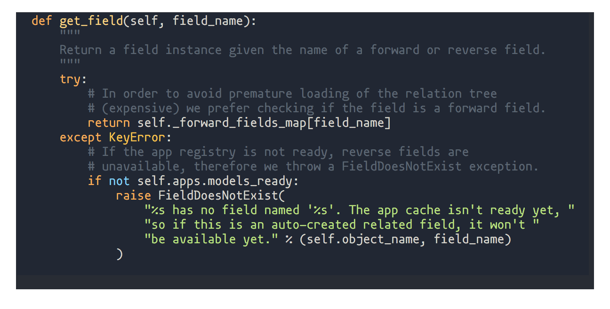
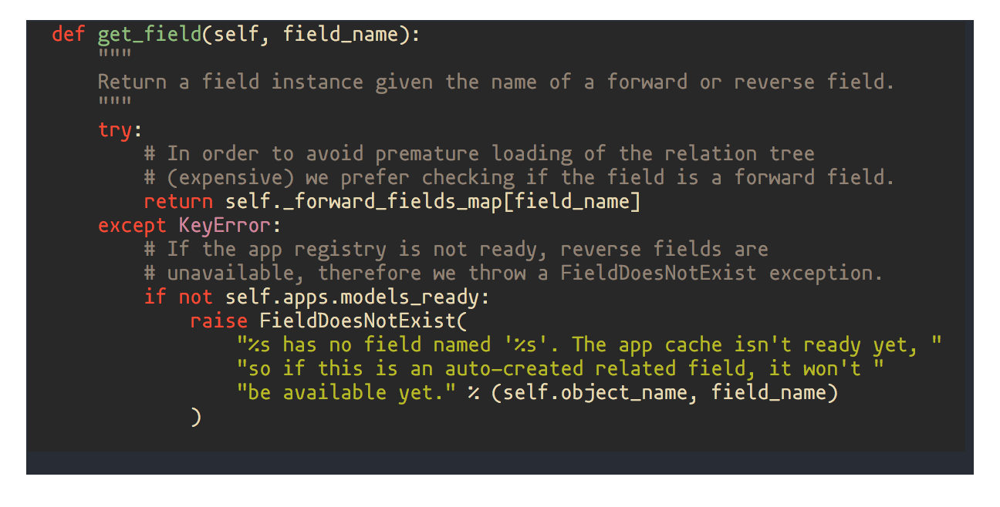
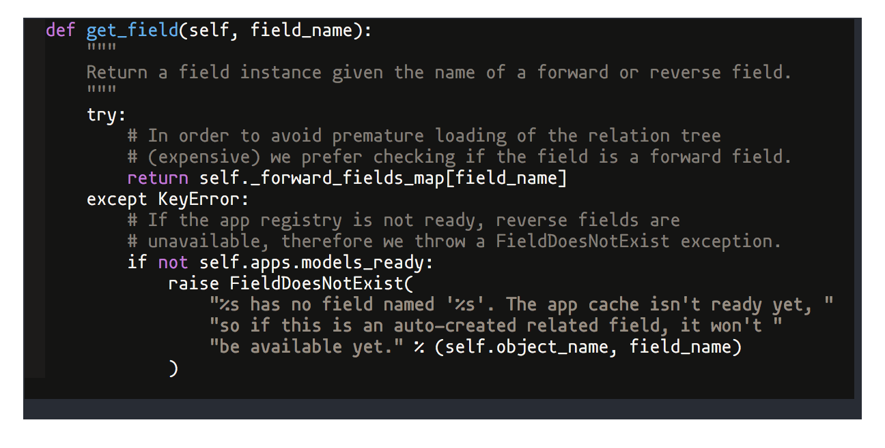
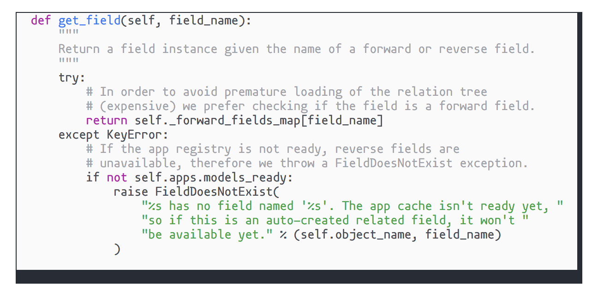
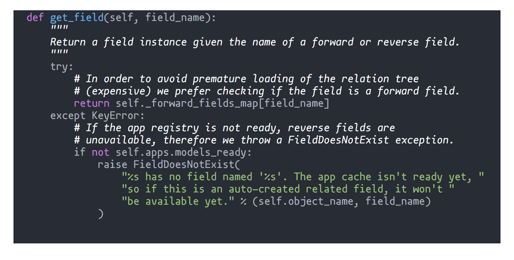
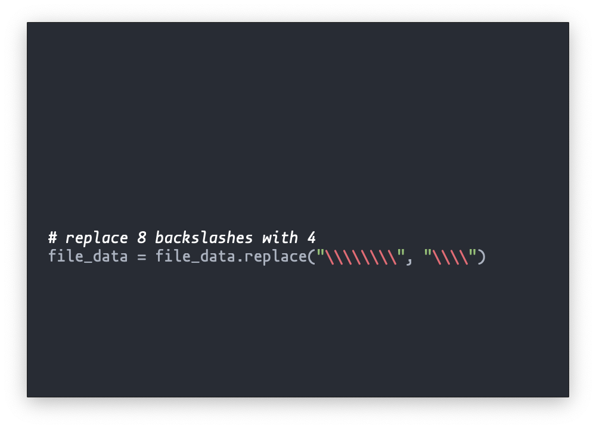
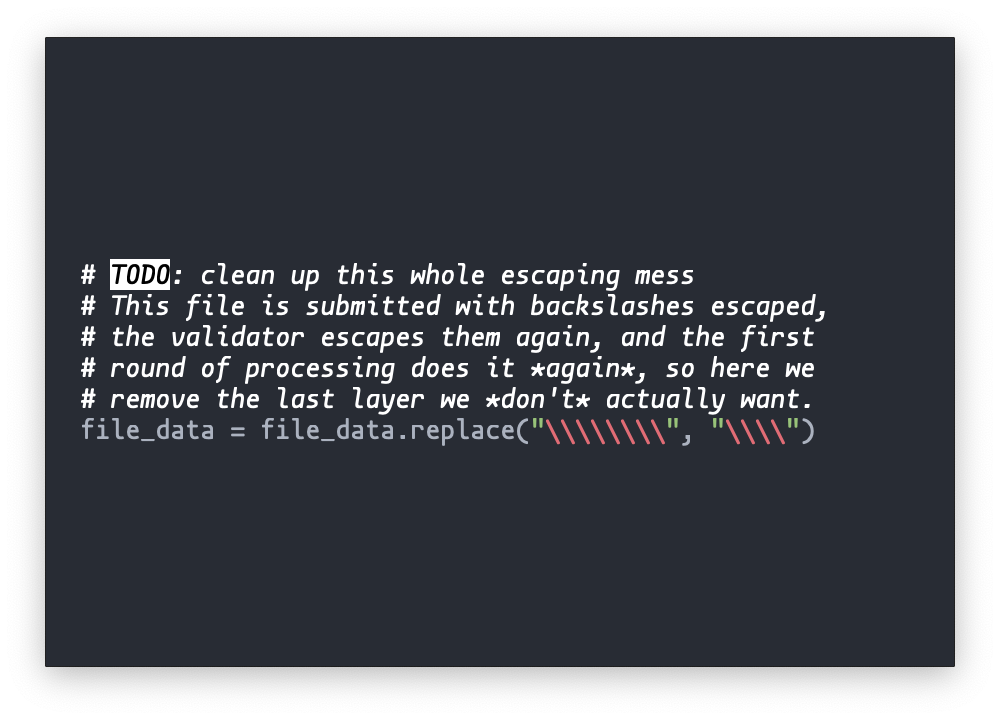

build-lists: true
slidenumbers: true
slidecount: true

# Hello!

^
Hi.

--------------------------------------------------

# # TODO: add comments

## 5 Tips for _Winning_ at Code Comments

### (according to Nik Kantar)

--------------------------------------------------

## Nik Kantar

- I make software, usually with Python.
- web(log): [nkantar.com](https://nkantar.com)
- code: [@nkantar](https://github.com/nkantar) (GitHub)
- toots: [@nkantar](https://twitter.com/nkantar) (Twitter)
- email: [nik@nkantar.com](mailto:nik@nkantar.com) (plz no recruiters)
- slides: [nkantar.com/talks](https://nkantar.com/talks)

--------------------------------------------------

## This talk…

- …is opinionated,
- and aims to be helpful
- and _hilarious_,
- but could probably use some work.
  (Read: feedback welcome!)

--------------------------------------------------

## The basics

- Q: What are code comments?
- A: `# this stuff`
- Q: Why are they important?
- A: Code is written for humans.
- Q: Who are they for?
- A: Me, you 6 months later, everyone else.

^
- humans don't read minds well
- we like context

--------------------------------------------------

## Advice disguised as a joke

### Write your code as if the person inheriting it is an axe murderer who knows where you live.

--------------------------------------------------

## The 5 tips

1. Make comments stand out in your editor.
- Explain the _why_, not the _what_.
- Don't fear the paragraph.
- Read what you wrote out loud.
- Ask for help!

--------------------------------------------------

## 1. Make comments stand out.

--------------------------------------------------

--------------------------------------------------

--------------------------------------------------

--------------------------------------------------

--------------------------------------------------

--------------------------------------------------

--------------------------------------------------

--------------------------------------------------

### Bad documentation is worse than no documentation.

^
- invisible
  = easy to ignore
  = gets ignored
  = falls out of date
- commented out code
- misleading
- bugs fix code
  what fixes comments?

--------------------------------------------------

## Conclusion #1:
## Make comments stand out.

--------------------------------------------------

## 2. _Why_, not _what_.

--------------------------------------------------

## _What_ vs _why_

- Myth: "Code is self-documenting."
- Truth: "Code can self-document _what_ happens."
- Comments: _Why_ is this…
  - …here?
  - …done this way?
  - …done at all?!

^
- truth is best case

--------------------------------------------------

--------------------------------------------------

--------------------------------------------------

--------------------------------------------------

--------------------------------------------------

--------------------------------------------------

## Conclusion #2:
## Explain the _why_, not the _what_.

--------------------------------------------------

## 3. Don't fear the paragraph.

--------------------------------------------------

## Brevity is a virtue, until it isn't.

- No bonus points for brevity at the expense of thoroughness.
- It's OK to have more comments than code.

^
- if you get points for excessive brevity, find another job

--------------------------------------------------

## Advice disguised as a joke, repeated

### Write your code as if the person inheriting it is an axe murderer who knows where you live.

--------------------------------------------------

## Conclusion #3:
## Don't be unnecessarily brief.

--------------------------------------------------

## 4. Read what you wrote out loud.

^
- sorry, open spacers

--------------------------------------------------

## Language matters

- Hearing your words will help you evaluate them.
- It helps with…
  - …typos!
  - …bad grammar!
  - …just plain nonsense (especially applicable if you've been staring at the screen for too long)!

^
- reading your words is skimming
  new reader reads slower

--------------------------------------------------

## Conclusion #4:
## Read your comments out loud.

--------------------------------------------------

## 5. Ask for help!

--------------------------------------------------

## Multiple perspectives

- Comments are largely for others—why not ask for feedback?
- Experts can verify correctness and completeness.
- Newbies can verify clarity.
- Everyone can pinpoint obvious issues.
- Great writers have great editors.

^
- "others" is you in 6 months, too
- "everyone" is non-employees
  just don't give away secrets

--------------------------------------------------

## Conclusion #5:
## Ask for help!

--------------------------------------------------

## Quick recap

1. Make comments stand out in your editor.
- Explain the _why_, not the _what_.
- Don't fear the paragraph.
- Read what you wrote out loud.
- Ask for help!

--------------------------------------------------

# Thank you!

-

### Send ~~help~~ feedback.

--------------------------------------------------

# Questions?

-

### Slides: nkantar.com/talks
