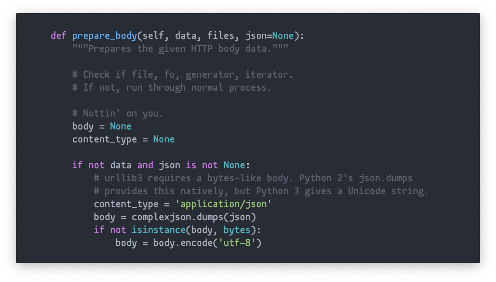

build-lists: true


# Hello!

^
Hi.


--------------------------------------------------


# # TODO: add comments

## 5 Tips for _Winning_ at Code Comments

### (according to Nik Kantar)


--------------------------------------------------


## Nik Kantar

- I make software, usually with Python.
- web(log): [nkantar.com](https://nkantar.com)
- code: [@nkantar](https://github.com/nkantar) (GitHub)
- toots: [@nkantar](https://twitter.com/nkantar) (Twitter)
- email: [nik@nkantar.com](mailto:nik@nkantar.com) (plz no recruiters)
- slides: [nkantar.com/talks](https://nkantar.com/talks)


--------------------------------------------------


## This talk…

- …is opinionated,
- aims to be helpful,
- and is _hilarious_,
- but could probably use some work.
  (Read: feedback welcome!)


--------------------------------------------------


## Wise quote

> "Bad documentation is worse than no documentation."
-- some wise people (and also me)

^
- no docs, you look at code
- bad docs, you trust them


--------------------------------------------------


## The basics

- Q: What are code comments?
  - A: `# this stuff`
- Q: Why are they important?
  - A: Code is written for humans.
- Q: Who are they for?
  - A: Me, you 6 months later, everyone else.

^
- humans can't read minds


--------------------------------------------------


## Another wise quote

> "Programs must be written for people to read, and only incidentally for machines to execute."
-- Harold Abelson, _Structure and Interpretation of Computer Programs_ (1979)


--------------------------------------------------


## The 5 tips

1. Make comments stand out in your editor.
- Explain the _why_, not the _what_.
- Don't fear the paragraph.
- Read what you wrote out loud.
- Ask for help!

^
- if you hate them, you can leave


--------------------------------------------------


## 1. Make comments stand out.


--------------------------------------------------





--------------------------------------------------


--------------------------------------------------


--------------------------------------------------


--------------------------------------------------


--------------------------------------------------


--------------------------------------------------


--------------------------------------------------


## Invisibility is bad.

- Invisible things are easy to ignore.
- Invisible comments get ignored.
- Ignored comments suffer in quality.
- Leftovers:
  - outdated comments
  - commented-out blocks of code


--------------------------------------------------


--------------------------------------------------


^
- not rocket surgery


--------------------------------------------------


--------------------------------------------------


## Conclusion #1:
## Make comments stand out.


--------------------------------------------------


## 2. _Why_, not _what_.


--------------------------------------------------

## _What_ vs _why_

- Myth: "Code is self-documenting."
- Truth: "Code can self-document _what_ happens."
- Comments: _Why_ is this…
  - …here?
  - …done this way?
  - …done at all?!

^
- truth is best case


--------------------------------------------------


## What-vs-why example

```
file_data = file_data.replace("\\\\\\\\", "\\\\")
```


--------------------------------------------------


## What-vs-why example

```
# replace 8 backslashes with 4
file_data = file_data.replace("\\\\\\\\", "\\\\")
```


--------------------------------------------------


## What-vs-why example

```
# wat? why. just why.
file_data = file_data.replace("\\\\\\\\", "\\\\")
```


--------------------------------------------------


## What-vs-why example

```
# y tho
file_data = file_data.replace("\\\\\\\\", "\\\\")
```


--------------------------------------------------


## What-vs-why example

```
# This file is submitted with backslashes escaped,
# the validator escapes them again, and the first
# round of processing does it *again*, so here we
# remove the last layer we don't actually want.
file_data = file_data.replace("\\\\\\\\", "\\\\")
```


--------------------------------------------------


## What-vs-why example

```
# TODO: clean up this whole escaping mess
# This file is submitted with backslashes escaped,
# the validator escapes them again, and the first
# round of processing does it *again*, so here we
# remove the last layer we don't actually want.
file_data = file_data.replace("\\\\\\\\", "\\\\")
```


--------------------------------------------------


## Conclusion #2:
## Explain the _why_, not the _what_.


--------------------------------------------------


## 3. Don't fear the paragraph.


--------------------------------------------------


## Brevity is a virtue, until it isn't.

- No bonus points for brevity at the expense of thoroughness.
- It's OK to have more comments than code.
  (Don't worry about all the extra bytes of text—it's fine.)

^
- general writing advice


--------------------------------------------------


## Conclusion #3:
## Don't be unnecessarily brief.


--------------------------------------------------


## 4. Read what you wrote out loud.

^
- sorry, open spacers


--------------------------------------------------


## Language matters

- Hearing your words will help you evaluate them.
- It helps with…
  - …typos!
  - …bad grammar!
  - …just plain nonsense (especially applicable if you've been staring at the screen for too long)!

^
- reading your words is skimming
  new reader reads slower


--------------------------------------------------


## Conclusion #4:
## Read your comments out loud.


--------------------------------------------------


## 5. Ask for help!


--------------------------------------------------


## Multiple perspectives

- Comments are largely for others—why not ask for feedback?
- Experts can verify correctness and completeness.
- Newbies can verify clarity.
- Everyone can pinpoint obvious issues.
- Great writers have great editors.

^
- "others" is you in 6 months, too
- "everyone" is non-employees
  just don't give away secrets


--------------------------------------------------

## Yet another wise quote

> "Be a good editor. The Universe needs more good editors, God knows."
-- Kurt Vonnegut, _Letters_ (2014)


--------------------------------------------------


## Conclusion #5:
## Ask for help!


--------------------------------------------------


## Quick recap

1. Make comments stand out in your editor.
- Explain the _why_, not the _what_.
- Don't fear the paragraph.
- Read what you wrote out loud.
- Ask for help!


--------------------------------------------------


# Thank you!

- Hope you had a good time.
- Send ~~help~~ feedback.
- Slides: [nkantar.com/talks](https://nkantar.com/talks)
- Questions, comments, et cetera: hallway, Twitter, email
- Bonus: PyBeach 2020, Los Angeles, CA 😎 ([pybeach.org](https://pybeach.org))
